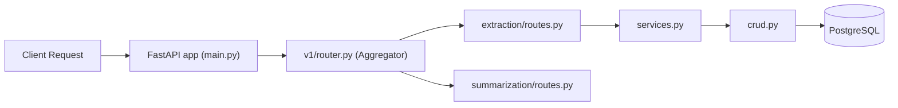

# Backend Architecture Guide: Feature-Based Modular Design

This guide provides a comprehensive breakdown of the newly implemented architecture for the **Smart Study Assistant** backend.

## 1. High-Level Overview
We have transitioned from a "flat/layered-only" structure to a **Feature-Based Modular Architecture**.

### Why this style?
- **Isolation**: Each feature (Extraction, Summarization, etc.) is a self-contained module.
- **Scalability**: New features can be added by creating a new folder without touching existing logic.
- **Team Independence**: Developers can work on different features simultaneously with near-zero merge conflicts.
- **MVP Focus**: The structure strictly follows the Product API Documentation, ensuring we only build what's defined in the scope.

---

## 2. Folder Structure Walkthrough

Each feature under `app/api/v1/features/` follows a strict internal protocol:

```text
app/api/v1/features/<feature_name>/
├── routes.py      # HTTP Endpoints & Router definitions
├── services.py    # Business Logic, AI Prompting, Third-party integrations
├── crud.py        # Database Access logic (Create, Read, Update, Delete)
├── models.py      # Database Schema (SQLAlchemy/Tortoise)
├── schemas.py     # Pydantic Request/Response validation models
└── __init__.py    # Makes the folder a Python package
```

### Shared Infrastructure (`app/core`)
Non-feature-specific code belongs here:
- `config.py`: Environment variables and global settings.
- `database.py`: Database engine and session management.
- `schemas/responses.py`: Global Success/Error JSON formats.

---

## 3. How Routing Works
We use a **Hierarchical Router Aggregation** strategy.

### Router Flow Diagram


- **Aggregation**: `app/api/v1/router.py` imports individual routers from each feature and mounts them.
- **Isolation**: Every feature has its own `APIRouter()` instance, meaning tags and prefixes are localized.

---

## 4. Alignment with API Documentation

The architecture maps 1:1 to the MVP Product Scope:

| API Doc Feature | Folder | Key Responsibilities |
| :--- | :--- | :--- |
| **Content Extraction** | `features/extraction` | Handles `POST /upload`, PDF parsing logic. |
| **Summarization** | `features/summarization` | Handles `POST /ai/summarize`, Gemini prompt engineering. |
| **Quiz Generation** | `features/quiz` | Handles `POST /ai/quiz`, Question/Option logic. |
| **Visual Diagram** | `features/diagram` | Handles `POST /ai/diagram`, Mermaid syntax rendering. |

---

## 5. Collaboration Workflow (Team Guide)

### Ownership Model
- **Feature Ownership**: One developer (or sub-team) owns a specific folder. 
- **The "No-Touch" Rule**: Do not modify files in other feature folders unless it's for a shared dependency (which should likely be in `app/core`).

### Reducing Merge Conflicts
1. **Isolated Files**: Since endpoints and logic are in different folders, Git merge conflicts on `routes.py` are rare.
2. **Aggregator Only**: the only shared file being edited occasionally is `v1/router.py` when adding a *new* feature.
3. **Small PRs**: Submit PRs for one feature at a time.

---

## 6. Separation of Concerns

| File | What goes here? | What NOT to put here? |
| :--- | :--- | :--- |
| **routes.py** | Endpoints, Status Codes, Dependency Injection. | Heavy logic, SQL queries, AI prompts. |
| **services.py** | AI Prompting, Calculations, Workflow logic. | Direct SQL queries, FastAPI Depends objects. |
| **crud.py** | Raw SQL Alchemy / ORM queries. | Business logic, non-DB operations. |
| **schemas.py** | Pydantic validation models. | Database models, heavy logic. |
| **models.py** | Database Table definitions. | API validation rules. |

---

## 7. Future Growth & Scalability

- **Adding v2**: Create `app/api/v2/` and mirror the structure.
- **Background Tasks**: Add a `tasks.py` inside the specific feature folder.
- **Caching**: Add a `cache.py` or implement logic inside `services.py`.
- **New Features**: Simply duplicate the folder structure for the new feature (e.g., `features/history`).

---

## 8. Rules & Conventions
1. **Plural Naming**: Use `routes.py`, `services.py`, `models.py`, `schemas.py` (all plural).
2. **Router Prefixing**: Always define prefixes in the aggregator (`v1/router.py`) to keep feature routers portable.
3. **Tagging**: Always tag your router in `v1/router.py` for clean `/docs` organization.
4. **Standard Responses**: Use `SuccessResponse` and `ErrorResponse` from `app.core.schemas.responses`.

---

## 9. Final Checklist for the Team

- [ ] **Next Step**: Start implementing logic in `services.py` for the Extraction feature.
- [ ] **What to Modify**: Only files inside your assigned `features/<name>` folder.
- [ ] **What NOT to Modify**: `app/core/*` unless you are adding a global utility.
- [ ] **Adding a Feature**:
    1. Create the folder.
    2. Add the 5 standard files.
    3. Register the router in `app/api/v1/router.py`.
